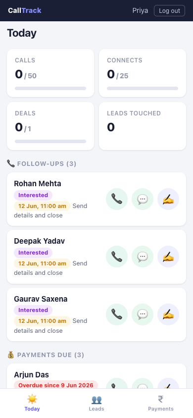
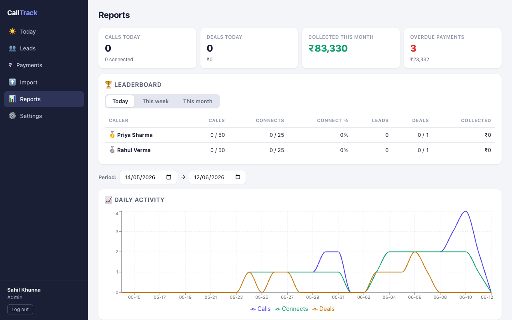
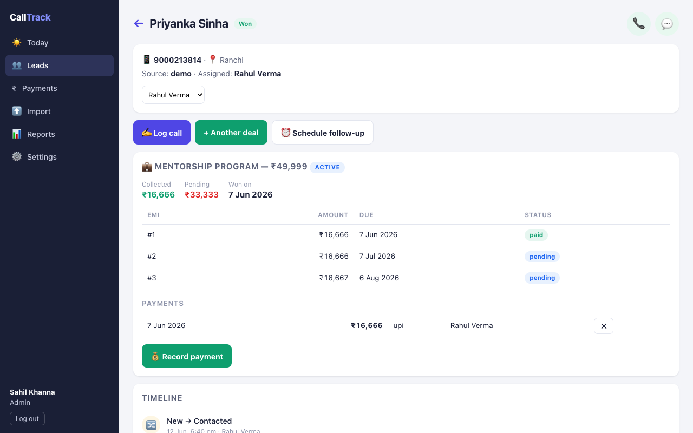
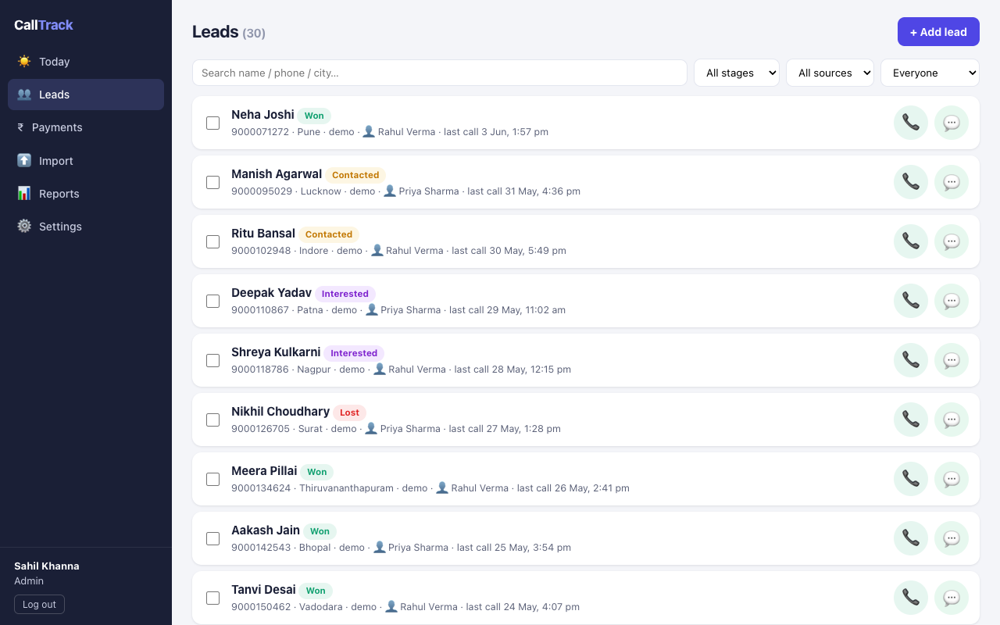

# CallTrack CRM

**A calling-team CRM that runs entirely in your office — no cloud, no subscriptions, your data never leaves your machines.**

Built for small sales/calling teams (2–15 callers + a manager): every call logged, every follow-up surfaced on time, every rupee due visible, and per-caller performance measurable. India-first: ₹ lakh/crore formatting, +91 phone handling, IST dates, WhatsApp integration.

| Caller's phone view | Admin reports |
|---|---|
|  |  |

| Lead detail with EMI tracking | Lead pipeline |
|---|---|
|  |  |

## 📥 Download

**Latest version: v1.0.1** — these links always point to the newest release:

| Platform | Download |
|---|---|
| **Mac** (Apple Silicon — M1/M2/M3/M4) | [CallTrack-CRM 1.0.1 — mac-arm64.dmg](https://github.com/lapaasindia/calltrack-crm/releases/latest/download/CallTrack-CRM-1.0.1-mac-arm64.dmg) |
| **Mac** (Intel) | [CallTrack-CRM 1.0.1 — mac-intel.dmg](https://github.com/lapaasindia/calltrack-crm/releases/latest/download/CallTrack-CRM-1.0.1-mac-intel.dmg) |
| **Windows** 10/11 (64-bit) | [CallTrack-CRM 1.0.1 Setup — win-x64.exe](https://github.com/lapaasindia/calltrack-crm/releases/latest/download/CallTrack-CRM-Setup-1.0.1-win-x64.exe) |

All versions: [Releases page](https://github.com/lapaasindia/calltrack-crm/releases).

Because the app isn't code-signed with a paid developer certificate (it's free software):
- **Mac**: if it says "can't be opened" → right-click the app → **Open** → Open (needed once).
- **Windows**: if SmartScreen appears → **More info → Run anyway** (needed once).

## How it works in your office

CallTrack is **local-first**: one computer in your office is the **main computer (host)** — it holds the database and serves your office WiFi. Everyone else connects to it. Nothing is ever sent to the internet.

1. **Install on the main computer** → first launch → choose **"This is the MAIN computer"**.
   Pick this on exactly ONE machine — the one that stays on during working hours.
   It can start automatically at login, keeps itself awake, and keeps serving even when
   its window is closed (tray icon).
2. **Install on the team's computers** → choose **"Connect to the main computer"** → type
   the host's address (find it on the host: menu → **Server → Connection Info**).
3. **Phones need no install** — callers open the host's address in their phone browser
   (same WiFi) and "Add to Home Screen". Tap-to-call and WhatsApp buttons work natively.

First login: **`admin` / `admin123`** — change it immediately in Settings → Team.

> Moving existing data in? On the setup screen choose **"I have a backup file — restore my
> data"** and pick your `crm-YYYY-MM-DD.sqlite` backup file.

## What it does

**For callers** (built mobile-first):
- **Today queue** — follow-ups due, overdue items that never silently disappear, and EMI/payments due, all in one prioritized list
- Tap-to-call (`tel:`) and **WhatsApp** buttons with prefilled message templates (placeholders for name, product, amount due, due date — Hindi/emoji safe)
- Call logging in seconds: Connected / Not picked / Busy / Switched off / Wrong number → outcome → notes → next follow-up (quick presets: today 5pm, tomorrow 11am…)
- Personal daily targets with live progress bars

**For the manager/admin:**
- Lead pipeline: New → Contacted → Interested → Follow-up → Won → Lost, with full per-lead history (every call, stage change, payment)
- **Import wizard**: upload Meta Lead Ads / Google Forms / any CSV or Excel export — auto column mapping, +91 phone normalization, duplicate detection (in-file and against existing leads), Excel-mangled numbers and Hindi-name encoding problems detected and reported, nothing silently dropped
- Lead assignment: per-lead, bulk, or distribute-equally round robin
- **Money tracking**: deals per product, EMI/installment schedules, partial payments, collected vs pending, overdue list sorted by urgency — all amounts stored exact (paise), ₹ lakh/crore formatting
- **Reports**: per-caller dials/connects/conversions by day, connect rate, team leaderboard vs targets (today/week/month), funnel conversion, revenue by product, lead-source performance — every report exports to CSV
- WhatsApp template editor, product catalog, daily targets per caller

**Built-in safety:**
- Automatic **daily backups** of the whole database (kept 30 days) — menu → Server → Open Backups Folder; "last backup" indicator + back-up-now button in Settings
- Roles enforced at the API: callers see only their own leads; admin sees everything

## Tracking definitions (so reports are never argued with)

- **Dials** = every logged call · **Connects** = calls marked Connected · **Connect rate** = connects ÷ dials
- **Conversion credit** goes to whoever closed the deal, on the day it was won
- **Funnel** counts real stage transitions in the period (not snapshots)
- **Pending** = deal value − payments received (never derived from EMI statuses)
- All "today" boundaries are IST: a call at 11:55 PM counts for that day, 12:10 AM for the next — regardless of computer timezone

## Getting leads in

- **Meta (Facebook/Instagram) Lead Ads**: Ads Manager → your form → Download leads (XLSX) → Import. Columns map automatically; campaign/adset info is kept on each lead.
- **Google Forms**: the linked Sheet → File → Download → CSV or XLSX → Import.
- **Tip**: prefer `.xlsx` over `.csv` — Excel-saved CSVs often destroy Hindi names and long phone numbers (the importer detects both and tells you).
- True auto-sync from Meta/Google would require a public internet server — CallTrack is local-only by design. A weekly export-import habit takes ~30 seconds.

## Run from source (instead of the app)

Requires [Node.js 22](https://nodejs.org). Good for development, or running the host headless:

```bash
git clone https://github.com/lapaasindia/calltrack-crm.git
cd calltrack-crm
npm run setup     # install, build, seed demo data
npm start         # prints LAN URLs + a QR code for phones
```

- `npm test` — unit tests (phone normalization, IST date math)
- `npm run seed` — demo data (2 callers, 30 leads, deals/EMIs); remove via Settings → Clear demo data
- `npm run install-autostart` — macOS LaunchAgent for a headless always-on host
- `npm run app` — run the desktop app in dev mode (first: `npm run app:rebuild`)

### Building the installers

```bash
npm run dist:mac    # DMGs for Apple Silicon + Intel (build on a Mac)
npm run dist:win    # Windows NSIS installer (cross-builds from macOS)
npm run dist        # all of the above → release/
```

Native-module notes (the hard-won kind):
- `better-sqlite3` must match the runtime ABI. The dist scripts handle flipping between Electron and Node automatically; after a build, your local checkout is restored for `npm start`.
- Cross-building for Windows fetches the win32 prebuild first (`scripts/fetch-win-sqlite.js`) — without it, a macOS binary gets silently packaged and crashes on Windows.
- On Apple Silicon, a locally rebuilt `.node` must be re-signed (`npm run app:rebuild` does it) or macOS kills the process on load.

## Architecture

Single Node.js process: Express API + SQLite (better-sqlite3, WAL) + static React build — wrapped in Electron for the desktop app, or run bare via `npm start`. The same server serves the app windows, browsers, and phones.

```
desktop/   Electron main process (host/join modes, tray, setup screen)
server/    Express API, SQLite schema/migrations, business logic, tests
client/    React 18 + Vite UI (mobile-first)
scripts/   installers, build helpers, screenshot generator
```

Key conventions: money in integer **paise**; instants stored UTC, business dates as IST calendar dates; one shared phone normalizer everywhere; append-only call/payment records; stage changes recorded as events for honest funnel reporting.

## Security model (read this)

Designed for a **trusted office LAN**: traffic is plain HTTP on your WiFi (TLS certificates aren't practical for offline LAN apps). Keep your WiFi WPA2-protected, don't reuse personal passwords, and you're fine for this threat model. Sessions are server-side, passwords bcrypt-hashed, role checks at the API layer.

## License

[MIT](LICENSE) — free to use, modify, and share.
