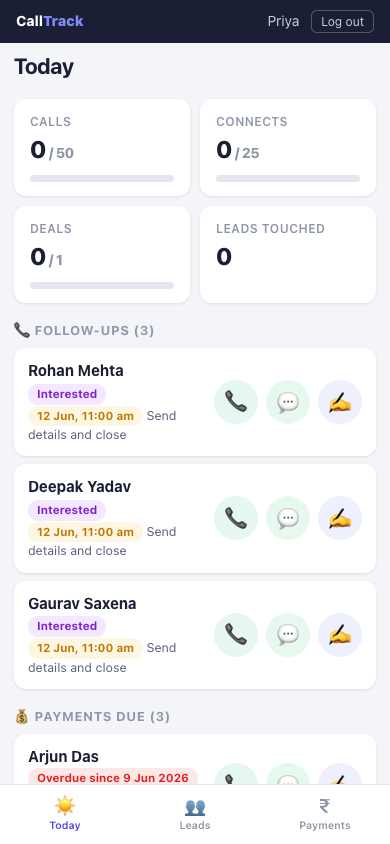
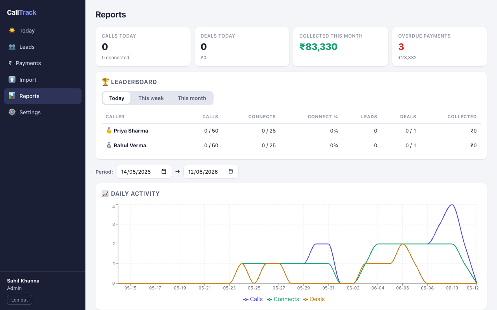
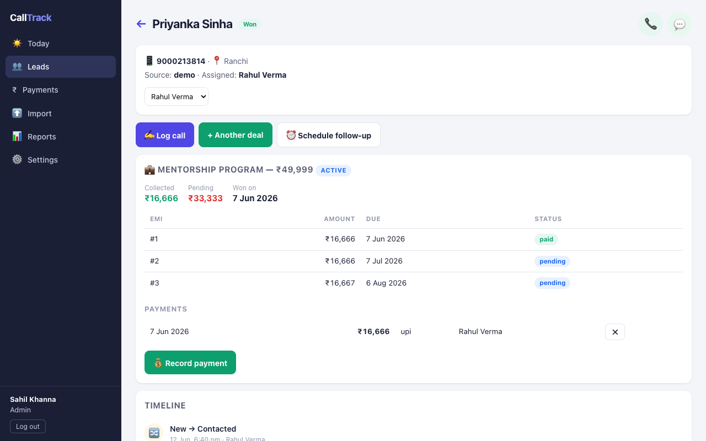
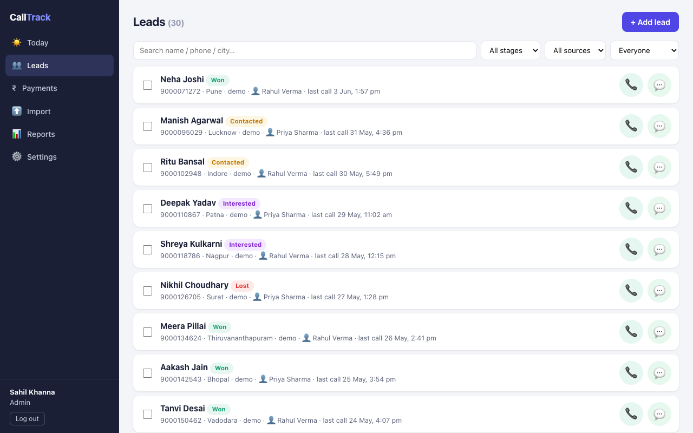

# CallTrack CRM

**A calling-team CRM that runs entirely in your office — no cloud, no subscriptions, your data never leaves your machines.**

Built for small sales/calling teams (2–15 callers + a manager): every call logged, every follow-up surfaced on time, every rupee due visible, and per-caller performance measurable. India-first: ₹ lakh/crore formatting, +91 phone handling, IST dates, WhatsApp integration.

| Caller's phone view | Admin reports |
|---|---|
|  |  |

| Lead detail with EMI tracking | Lead pipeline |
|---|---|
|  |  |

## 📥 Download

<!-- release-links:start -->
<!-- Generated by scripts/bump-version.mjs — do not edit by hand. -->
**Latest version: v1.2.1** ([what changed](CHANGELOG.md#121---2026-06-18) · [all releases](https://github.com/lapaasindia/calltrack-crm/releases))

| Platform | Download |
|---|---|
| **Mac** (Apple Silicon — M1/M2/M3/M4) | [CallTrack-CRM 1.2.1 — mac-arm64.dmg](https://github.com/lapaasindia/calltrack-crm/releases/download/v1.2.1/CallTrack-CRM-1.2.1-mac-arm64.dmg) |
| **Mac** (Intel) | [CallTrack-CRM 1.2.1 — mac-x64.dmg](https://github.com/lapaasindia/calltrack-crm/releases/download/v1.2.1/CallTrack-CRM-1.2.1-mac-x64.dmg) |
| **Windows** 10/11 (64-bit) | [CallTrack-CRM 1.2.1 Setup — win-x64.exe](https://github.com/lapaasindia/calltrack-crm/releases/download/v1.2.1/CallTrack-CRM-Setup-1.2.1-win-x64.exe) |
| **Android** call-capture app | [CallTrack-CRM 1.2.0 — android.apk](https://github.com/lapaasindia/calltrack-crm/releases/download/v1.2.0/CallTrack-CRM-1.2.0-android.apk) (release-signed; 1.2.1 has no release-signed APK) |

Links point at a **specific** release, so they keep working after the next one ships. From the next release on, every asset comes with a `SHA256SUMS.txt` and a build-provenance attestation.
<!-- release-links:end -->

> The source tree (and `/api/health`) currently reports **1.2.2** — bug fixes on top of 1.2.1 that
> were never cut as installers. The next release is produced with `scripts/bump-version.mjs`
> (see [CONTRIBUTING.md](CONTRIBUTING.md#releases)), which also rewrites this table.

**📱 Android call-capture app** (optional): once the desktop app is running, install
it on callers' Android phones from `http://<office-server>:3000/download/calltrack.apk`
and pair via QR — see the **[mobile guide](docs/MOBILE.md)**. That LAN link serves whatever
the office computer last published with `node scripts/publish-apk.js <release.apk>` (phones
auto-update from it), so publish each new release-signed APK there.

Because the app isn't signed with a paid Apple/Microsoft certificate (it's free software), each computer needs **one quick approval the first time**. The app itself runs perfectly on both **Apple Silicon (M1–M4)** and **Intel** Macs — this is only macOS/Windows being cautious about web downloads.

**🍎 Mac (Apple Silicon *and* Intel)** — macOS quarantines apps downloaded from the web and will say *"CallTrack CRM is damaged and can't be opened."* It is **not** damaged — that's just the quarantine flag. Clear it once:
1. Drag **CallTrack CRM** into your **Applications** folder.
2. Open **Terminal** (press **⌘ + Space**, type `Terminal`, hit **Enter**), then paste this line and press **Enter**:
   ```bash
   xattr -cr "/Applications/CallTrack CRM.app" && open "/Applications/CallTrack CRM.app"
   ```
   The app opens immediately, and you'll never need to do this again on that Mac.

**🪟 Windows 10/11** — the blue **"Windows protected your PC"** box (SmartScreen) → click **More info** → **Run anyway** (needed once).

> **Trouble installing, opening, or pairing a phone?** See the **[Troubleshooting guide](docs/TROUBLESHOOTING.md)** — Mac "damaged", Windows SmartScreen, QR/phone pairing, and connection issues.

## How it works in your office

CallTrack is **local-first**: one computer in your office is the **main computer (host)** — it holds the database and serves your office WiFi. Everyone else connects to it. Nothing is ever sent to the internet.

1. **Install on the main computer** → first launch → choose **"This is the MAIN computer"**.
   Pick this on exactly ONE machine — the one that stays on during working hours.
   It can start automatically at login, keeps itself awake, and keeps serving even when
   its window is closed (tray icon).
2. **Install on the team's computers** → choose **"Connect to the main computer"** → type
   the host's address (find it on the host: menu → **Server → Connection Info**).
3. **Phones need no install** — callers open the host's address in their phone browser
   (same WiFi) and "Add to Home Screen". Tap-to-call and WhatsApp buttons work natively.

### Default logins

A fresh install always creates one admin account. If you installed the demo data
(`npm run setup` / `npm run seed`), two sample callers are added too.

| Username | Password | Role | Created by | First login |
|---|---|---|---|---|
| `admin` | `admin123` | Admin (owner) | every install | **must change the password before anything else works** |
| `priya` | `caller123` | Caller | demo data only | demo account — delete it |
| `rahul` | `caller123` | Caller | demo data only | demo account — delete it |

The default admin is locked to the change-password screen until it picks a real
password — on the desktop app's first run **and** on `npm run setup` / `npm run seed`.
To skip that step on a scripted install, set `CRM_ADMIN_PASSWORD=<real password>` before
the first start and the admin is created with it directly.

> ⚠️ **Remove the demo callers.** Log in as `admin`, go to **Settings → Team**, and either
> delete `priya`/`rahul` or use **Settings → Clear demo data**. Anyone on your office WiFi
> can reach the app, so the defaults are for first setup only — never leave them in place on
> a real deployment. Changing a password (or an admin resetting one) logs that user out
> everywhere and un-pairs their phones, so re-pair after a reset.

> **Lost the admin password and there is no other admin?** On the host computer run
> `node scripts/reset-admin.js` (stop the server first) — it sets a temporary password and
> forces a change on the next login.

> Moving existing data in? On the setup screen choose **"I have a backup file — restore my
> data"** and pick your `crm-YYYY-MM-DD.sqlite` backup file.

### Roles

Every API route checks the role server-side (`server/lib/permissions.js`); the UI only
hides what you cannot do.

| Role | Sees | Can do |
|---|---|---|
| `super_admin` / `admin` (owner tier) | everything | manage team, settings, product/service catalog, admin dashboard, backups, WhatsApp/Drive/AI integrations, pair any phone, delete records |
| `manager` | all leads, deals, reports | manage the team (except owners), assign/reassign leads, delete records — **not** settings, catalog or integrations |
| `agent` / `caller` | only leads assigned to them | log calls, follow-ups, deals and payments on their own leads; tasks, projects, meetings; pair their own phone |
| `employee` | only their own leads/tasks | non-sales staff: tasks, projects, time blocks, meetings; same lead scoping as an agent |
| `read_only` | reports and dashboards, no lead lists of its own | look, never change: every write is refused (403). Can still change its own password |

`admin` and `caller` are the original two roles; existing accounts keep working unchanged.

## What it does

**For callers** (built mobile-first):
- **Today queue** — follow-ups due, overdue items that never silently disappear, and EMI/payments due, all in one prioritized list
- Tap-to-call (`tel:`) and **WhatsApp** buttons with prefilled message templates (placeholders for name, product, amount due, due date — Hindi/emoji safe)
- Call logging in seconds: Connected / Not picked / Busy / Switched off / Wrong number → outcome → notes → next follow-up (quick presets: today 5pm, tomorrow 11am…). An unanswered attempt keeps the follow-up due instead of marking it done
- Personal daily targets with live progress bars

**For the manager/admin:**
- Lead pipeline: New → Contacted → Interested → Follow-up → Won → Lost, with full per-lead history (every call, stage change, payment)
- **Import wizard**: upload Meta Lead Ads / Google Forms / any CSV or Excel export — auto column mapping, +91 phone normalization, duplicate detection (in-file and against existing leads), Excel-mangled numbers and Hindi-name encoding problems detected and reported, nothing silently dropped
- Lead assignment: per-lead, bulk, or distribute-equally round robin (agents and callers, persistent cursor)
- **Money tracking**: deals per product, EMI/installment schedules, partial payments, collected vs pending, overdue list sorted by urgency — all amounts stored exact (paise), ₹ lakh/crore formatting
- **Reports**: per-caller dials/connects/conversions by day, connect rate, team leaderboard vs targets (today/week/month), funnel conversion, revenue by product, lead-source performance — every report exports to CSV
- WhatsApp template editor, product catalog, daily targets per caller, invoices with GST

**📱 Android call capture (optional) — [full guide](docs/MOBILE.md):**
- A companion Android app auto-captures every call: known numbers attach to the
  right lead, **unknown numbers become leads with one tap**, recordings upload to
  the office computer — no manual logging
- **Local AI** (optional, free): transcribes recordings with whisper.cpp and uses
  a local LLM to *suggest* lead fields, follow-ups, and tasks — runs entirely on
  the office Mac, the caller accepts suggestions with one tap (AI never overwrites
  data on its own)
- **Tasks** module: standalone to-dos (with or without a lead), in the Today queue
- All recordings/transcripts stay on the office computer; nothing touches the cloud

**Built-in safety:**
- Automatic **daily backups** of the whole database (kept 30 days), taken with SQLite's
  online backup API and verified before they replace the previous file — menu → Server →
  Open Backups Folder; "last backup" indicator + back-up-now button in Settings.
  Optional **encrypted off-site backup** to your own Google Drive ([guide](docs/GOOGLE-DRIVE-BACKUP.md))
- Roles enforced at the API (table above); every response carries an `X-Request-Id` and
  the server writes a structured log (`data/logs/server.log`, 14 days) for support
- Recordings kept 90 days (configurable) then auto-purged; transcripts kept forever
- Per-device daily upload quota and disk-space floor so one phone cannot fill the host
- Owner-only `GET /api/ops/health`: database integrity, WAL size, backup age, AI queue,
  event-loop lag, free disk

## Tracking definitions (so reports are never argued with)

- **Dials** = every logged call · **Connects** = calls marked Connected · **Connect rate** = connects ÷ dials
- **Conversion credit** goes to whoever closed the deal, on the day it was won
- **Funnel** counts real stage transitions in the period (not snapshots)
- **Pending** = deal value − payments received (never derived from EMI statuses); an installment is *overdue* only when money is still owed on it after its due date
- All "today" boundaries are IST: a call at 11:55 PM counts for that day, 12:10 AM for the next — regardless of computer timezone

## Getting leads in

- **Meta (Facebook/Instagram) Lead Ads**: Ads Manager → your form → Download leads (XLSX) → Import. Columns map automatically; campaign/adset info is kept on each lead.
- **Google Forms**: the linked Sheet → File → Download → CSV or XLSX → Import.
- **Tip**: prefer `.xlsx` over `.csv` — Excel-saved CSVs often destroy Hindi names and long phone numbers (the importer detects both and tells you).
- True auto-sync from Meta/Google would require a public internet server — CallTrack is local-only by design. A weekly export-import habit takes ~30 seconds.

## Run from source (instead of the app)

Requires [Node.js](https://nodejs.org) **22 LTS (22.23 or newer) or 24** — `engines` is
`>=22.12 <25` and `.npmrc` enforces it. Good for development, or running the host headless:

```bash
git clone https://github.com/lapaasindia/calltrack-crm.git
cd calltrack-crm
npm run setup     # install, build, seed demo data (admin must change admin123 on first login)
npm start         # prints LAN URLs + a QR code for phones
```

- `npm test` — the server suite (auth, roles, money math, IST dates, sync, migrations, ops) + desktop pure-logic tests; runs against a temporary database
- `npm run seed` — demo data (2 callers, 30 leads, deals/EMIs); remove via Settings → Clear demo data
- `npm run install-autostart` — macOS LaunchAgent (`com.calltrack.crm`) for a headless always-on host
- `npm run app` — run the desktop app in dev mode (see [docs/DESKTOP-TESTING.md](docs/DESKTOP-TESTING.md))
- `npm run test:desktop` — real-Electron download smoke test on this OS

Developer workflow, conventions and the release ritual: **[CONTRIBUTING.md](CONTRIBUTING.md)**.
How the pieces fit: **[docs/ARCHITECTURE.md](docs/ARCHITECTURE.md)**.

### Updating the office computer

The web UI is served by the host, so **a client rebuild goes live on the next page load**;
**server changes need a restart**. On the office Mac running the LaunchAgent:

```bash
cd ~/Desktop/CRM\ FABLE            # wherever the checkout lives
git pull
npm ci                              # only if package-lock.json changed
npm --prefix client ci && npm --prefix client run build
launchctl kickstart -k gui/$(id -u)/com.calltrack.crm     # restart the server (finishes in-flight work, ~1 s)
curl -s http://localhost:3000/api/health                   # {"app":"calltrack-crm","version":"…"}
```

Migrations run automatically on start (a backup is taken daily; take one from Settings first
if you are nervous). An older build refuses to open a database written by a newer one, so
never downgrade without restoring the matching backup. Desktop-app hosts update by installing
the new DMG/EXE — the data folder is kept.

### Building the installers

```bash
npm run icons       # one-time per clone: generates build/icon.* (gitignored) — dist fails without it
npm run dist:mac    # DMGs for Apple Silicon + Intel (build on a Mac)
npm run dist:win    # Windows NSIS installer (cross-builds from macOS)
npm run dist        # all of the above → release/
```

Releases are normally built by **GitHub Actions** (`.github/workflows/release.yml`, triggered by
a `v*` tag) rather than on a developer laptop: it produces the DMGs, the EXE, the release-signed
APK (when the keystore secrets are set), `SHA256SUMS.txt` and provenance attestations, and opens
a draft release.

Native-module notes (the hard-won kind):
- `better-sqlite3` must match the runtime ABI. The dist scripts flip between the Electron and Node
  builds and restore the Node one at the end — so **never run `npm run dist` or an
  `electron-rebuild` in the checkout that the office LaunchAgent serves from** (an interrupted
  build leaves the live server unable to load SQLite). Build from CI or a separate clone.
- The `better-sqlite3` prebuilds for every target (mac arm64/x64, win x64) are staged into `build/native/` by `npm run native` (`scripts/fetch-electron-sqlite.js`; with better-sqlite3 13 these are the N-API prebuilds bundled inside the npm package, so nothing is downloaded), magic-byte checked, load-tested inside the installed Electron, SHA-256-pinned in `build/native/native.lock.json` (committed — the release runner fails on a mismatch) and shipped as `Resources/native`. The repo's own `node_modules` is never modified — never run `dist` or a rebuild in the office LaunchAgent checkout.
- On Apple Silicon, a locally rebuilt `.node` must be re-signed or macOS kills the process on load.

## Architecture

Single Node.js process: Express API + SQLite (better-sqlite3, WAL) + static React build — wrapped in Electron for the desktop app, or run bare via `npm start`. The same server serves the app windows, browsers, and phones.

```
desktop/   Electron main process (host/join modes, tray, setup screen)
server/    Express API, SQLite schema/migrations, business logic, tests
client/    React 18 + Vite UI (mobile-first)
mobile/    Capacitor Android app (WebView UI + Kotlin call-capture plugins)
scripts/   release, publish, installer and ops helpers
```

Key conventions: money in integer **paise**; instants stored UTC, business dates as IST calendar dates; one shared phone normalizer everywhere; append-only call/payment records; stage changes recorded as events for honest funnel reporting. The full picture — process model, data invariants, deployment topologies, the phone sync protocol, backups, where every version string lives — is in **[docs/ARCHITECTURE.md](docs/ARCHITECTURE.md)**, and the reasoning behind the big choices in **[docs/adr/](docs/adr/)**.

## For students & learners — how auth and credentials work

If you're reading this repo to learn, here's the map of the login/security code and
the default credentials (these are demo defaults, safe to share — see the warning below):

- **Default accounts** — created in code, not stored as plaintext anywhere:
  - `server/bootstrap.js` — every fresh install creates **`admin` / `admin123`** with
    `must_change_password = 1`, so the first login can only change the password.
  - `server/seed.js` — demo data adds **`priya` / `caller123`** and **`rahul` / `caller123`**
    (labelled DEMO) and applies the same forced change to the admin.
  - Passwords are hashed with **bcrypt** (`bcryptjs`) before being stored; the database
    only ever holds the hash, never the plaintext. Unknown usernames still pay the bcrypt
    cost, so login timing does not reveal whether a user exists.
- **How login works** — `server/routes/auth.js` (`/login` verifies the bcrypt hash,
  throttles per IP and per user, and regenerates the session to prevent fixation) →
  `server/middleware/auth.js` (`requireAuth` loads the user from the session cookie, or
  from a paired phone's **bearer token**; `requirePasswordChanged`; `requireWriter` blocks
  `read_only` writes) → role checks via `server/lib/permissions.js` and `canAccessLead`.
- **Device pairing (mobile)** — `server/routes/devices.js` issues one-time codes;
  `server/routes/auth.js` `/pair` exchanges a code for a 90-day token whose **SHA-256
  hash** (not the token) is stored in `device_tokens`. Changing a password revokes
  the user's tokens and sessions.

> 🔑 **A real lesson in secret management:** you'll notice this public repo contains the
> *demo* passwords but **not** the production admin password or the APK signing-keystore
> password. That's deliberate and is the correct practice: secrets that protect real data
> or sign code you ship to phones must **never** be committed to version control — once
> pushed, they live forever in git history, forks, and scrapers. Keep them in a local
> untracked file, a password manager, or environment variables instead. The keystore for
> this project, for example, lives outside the repo and is configured via the
> `CALLTRACK_KEYSTORE` / `CALLTRACK_KEYSTORE_PASS` environment variables (see
> [docs/ANDROID-APK.md](docs/ANDROID-APK.md)); in CI they are repository secrets.

## Security

Designed for a **trusted office LAN**, but the app does not rely on the network being
friendly: server-side sessions, bcrypt passwords with forced rotation of the default admin,
login throttling, expiring device tokens, role checks on every API route, upload quotas,
and a runtime dependency audit that gates CI.

**Turn on TLS.** Traffic is plain HTTP by default so the first run "just works", but the
server speaks HTTPS when you give it a certificate — and then session cookies become
`Secure` and pairing QR codes use `https://` automatically:

```bash
# e.g. a LAN-trusted cert from mkcert (install its root CA on the phones/laptops once)
CRM_TLS_CERT=/path/to/cert.pem CRM_TLS_KEY=/path/to/key.pem npm start
```

Keep the WiFi WPA2/WPA3-protected, don't reuse personal passwords, and back up
`data/secret.key` separately from the database. What we consider a vulnerability, how to
report one privately, and the supported versions are in **[SECURITY.md](SECURITY.md)**; the
June 2026 audit and its remediation log are in [docs/](docs/SECURITY-REMEDIATION.md).

## License

[MIT](LICENSE) — free to use, modify, and share. The bundled WhatsApp engine depends on
`libsignal` (GPL-3.0); see [THIRD-PARTY-NOTICES.md](THIRD-PARTY-NOTICES.md) before
redistributing a closed-source fork.
