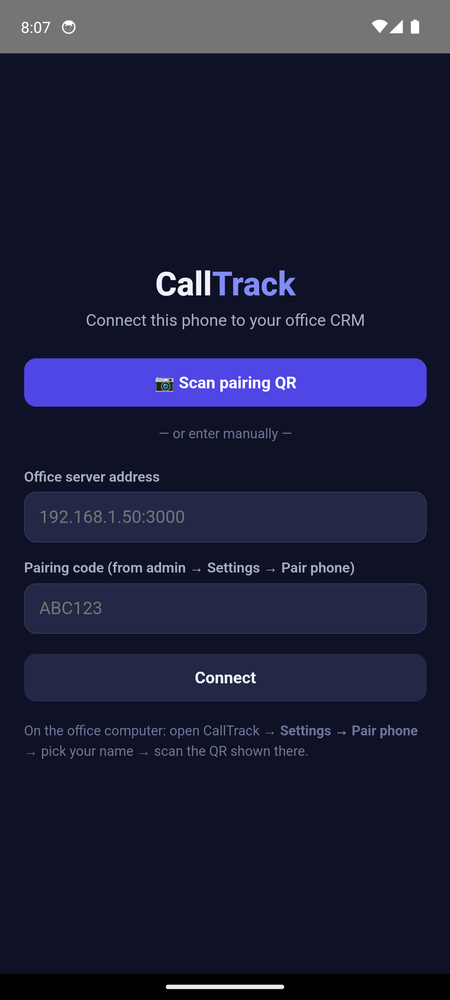

# CallTrack Mobile — Android call capture

The mobile app turns every call your team makes into automatic CRM tracking:
calls attach to the right lead by phone number, recordings get uploaded and
(optionally) transcribed by AI, and new numbers become leads with one tap.
**Everything stays on your office computer — nothing goes to the internet.**

<p align="center"></p>

> **Android only.** iPhones cannot record calls (Apple blocks it system-wide).
> iPhone users can still use the web app in their browser — they just won't get
> automatic recording.

---

## Before you start: does the phone record calls?

The app reads recordings made by the **phone's own dialer**. So call recording
must be turned on in the dialer first. This works on most Indian phones —
**Xiaomi/Redmi/POCO, Samsung, realme, OPPO, vivo, OnePlus** — but NOT on phones
using the Google Phone app (Pixel and some others: Google's recordings are
locked inside its app and it announces "this call is being recorded").

**Turn on auto call recording** (do this once per phone):
- Open the **Phone/Dialer app → ⋮ menu → Settings → Call recording**
- Turn on **"Auto record calls" → All calls**
- Make a 1-minute test call, then check the recordings folder exists (varies by
  brand: `Recordings/Call`, `MIUI/sound_recorder/call_rec`, `Music/Recordings`…)

If there's no "Call recording" option at all, that phone can still do **call
logging** (every call attaches to leads) — just no audio/transcript.

---

## Installing the app (once per phone, ~10 minutes)

1. **Get the APK.** On the phone's browser, open the office server address
   followed by `/download/calltrack.apk` (e.g. `http://192.168.1.50:3000/download/calltrack.apk`).
   Tap the downloaded file to install.
2. **Allow install from this source** — Android will ask once; tap **Settings →
   allow → back → Install**.
3. **Play Protect warning** ("unsafe app") — this is normal for any app not from
   the Play Store. Tap **More details → Install anyway**. It's your own app.
4. **Open the app**, tap **Scan pairing QR**.
5. On the office computer, open CallTrack → **Settings → Paired phones → Pair
   phone** → pick the caller's name → a QR appears. Scan it.
6. **Confirm the server** — the app shows "Pair this phone with 192.168.x.x:3000?"
   Only tap OK if that is your office computer (it refuses anything that is not
   a LAN address).
7. **Grant the permissions** the app's setup screen asks for:
   - **Call log** — tap Allow
   - **Audio access** — tap Allow (lets the app find the dialer's recordings)
   - **Recordings folder** — tap Choose and pick the folder your Phone app
     saves call recordings in (e.g. `Recordings/Call`). The app refuses the
     whole "Internal storage" root and only uploads files whose folder or name
     looks like a call recording — songs and voice notes are never uploaded.
   - **Battery: no restrictions** — so syncing keeps working in the background
   - **Auto-start** — see the per-brand steps below (shown as "Not needed on
     this phone" where the brand has no such screen)

That's it — calls start syncing. The app syncs right after pairing, every time
it's opened, a few seconds after each call ends (background service) and every
15 minutes. The sync chip at the top is **green only after a successful sync**;
if it turns red, tap it — the error is shown as a message and under
**Settings → Last error**. Only calls made **after pairing** are synced (never
more than the last 30 days if the phone was offline for long).

---

## Per-brand background settings (important on Xiaomi/OPPO/vivo)

Indian phone brands aggressively kill background apps. Without these, syncing
only happens when the caller opens the app (which is still fine, but less
automatic). Do these once:

**Xiaomi / Redmi / POCO (MIUI/HyperOS):**
- Security app → **Autostart** → enable CallTrack
- Settings → Apps → CallTrack → **Battery saver → No restrictions**
- In Recent apps, swipe down on CallTrack and tap the **lock** icon

**realme / OPPO (ColorOS):**
- Settings → Apps → CallTrack → **Allow auto launch** ON
- Settings → Battery → CallTrack → **Allow background activity**

**vivo (Funtouch):**
- Settings → Battery → Background power consumption → CallTrack → Allow
- i Manager → App manager → Autostart → CallTrack ON

**Samsung (One UI):** usually fine. Settings → Apps → CallTrack → Battery →
**Unrestricted**.

**OnePlus:** Settings → Battery → CallTrack → **Don't optimize**; lock in Recents.

The app's setup screen has an **"Auto-start"** button that jumps to the right
screen for most of these brands.

---

## How calls flow (what the caller sees)

- **Known number** (already a lead) → the call auto-attaches to that lead with
  a recording. The caller marks what happened ("Interested" etc.) in the
  **Review** tab when convenient.
- **Unknown number** → appears in **Review → New numbers**. One tap to **create
  a lead**, or **Ignore** / **Never** (Never = never show that number again,
  for family/delivery calls).
- **Recordings** play inside the lead's timeline on the web app and the phone.

## AI transcription (optional, free, local)

If turned on (CallTrack → Settings → AI call transcription, on the office
computer), each recording is transcribed and the AI **suggests** updates: the
customer's city, what they're interested in, a follow-up if they asked to be
called back, and a task if you promised to send something. The caller reviews
and accepts with one tap — the AI never changes lead data on its own.

Requires whisper.cpp + Ollama installed on the office Mac (see the main README).
Runs entirely offline.

---

## Privacy & legal

- Recording your own business calls is legal in India. Good practice: have
  callers mention calls may be recorded for quality.
- All recordings and transcripts stay on the office computer. Audio is kept for
  90 days by default (configurable), then deleted — transcripts stay.
- A phone's access can be cut instantly: CallTrack → Settings → Paired phones →
  Disconnect. The phone stops syncing immediately, its background service
  stops, and the app drops back to the pairing screen with "This phone was
  disconnected or the pairing expired — scan the QR again". Pairings also
  expire after 90 days (one QR scan to renew).
- The device token is stored on the phone in the Android Keystore-backed
  encrypted store (never in the web layer's storage).
- Passwords/tokens travel over your office WiFi in plain form — keep the WiFi
  WPA2-protected, as with the rest of CallTrack.

## Updating the app

When a new version is published, the app checks once a day on open and offers
the download (or check manually: Settings → Check for app update). The APK is
downloaded by the phone's browser — tap the finished download to install it
over the old version.

## Building & publishing the APK (admin/dev)

```bash
# one-time: generate a signing keystore and BACK IT UP somewhere safe
keytool -genkeypair -keystore calltrack-release.keystore -alias calltrack \
  -keyalg RSA -keysize 2048 -validity 10000

# the version comes from the root package.json (versionName = its "version",
# versionCode = major*10000 + minor*100 + patch, e.g. 1.2.2 → 10202) — bump
# package.json, never build.gradle
npx cap sync android
cd mobile/android
CALLTRACK_KEYSTORE=/path/to/calltrack-release.keystore \
CALLTRACK_KEYSTORE_PASS=yourpass \
JAVA_HOME=/opt/homebrew/opt/openjdk@17/libexec/openjdk.jdk/Contents/Home \
  ./gradlew assembleRelease --no-daemon
# (assembleRelease refuses to run without CALLTRACK_KEYSTORE — an unsigned APK is useless)

# publish it to the office server so phones can download/update
cd ../..
node scripts/publish-apk.js mobile/android/app/build/outputs/apk/release/app-release.apk 10202 1.2.2
```

> ⚠️ **Keep the keystore + password forever.** Updates must be signed with the
> same key — lose it and every phone has to uninstall/reinstall.
